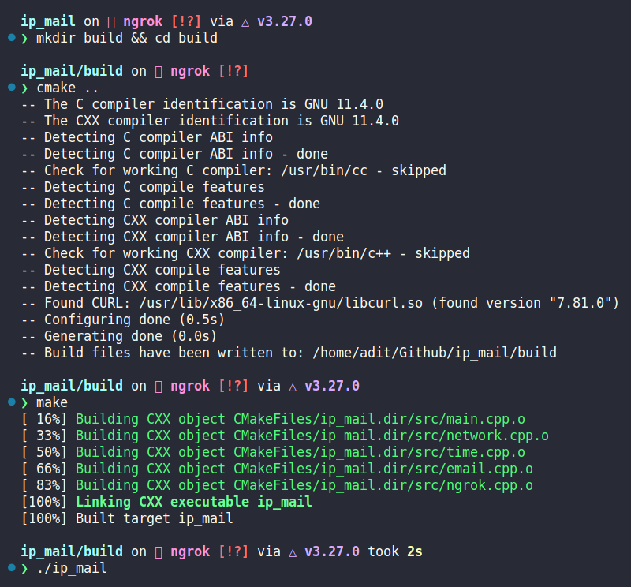

# IP Mail

## Introduction
A simple C++ program that can be run on boot or on network change to send local ip address of the system to a pre-defined email ID, eliminating the need to connect an external monitor, find the ip and then ssh into the device. An additional feature in this branch is tcp tunneling using ngrok.

## Setup
1. cURL, Cmake and a C++ compiler is required for compiling the code. Also install openssh-server for the ability to ssh.
```sh
sudo apt install curl cmake make g++ openssh-server -y
```
2. Install [ngrok](https://ngrok.com/download) on your device. Configure your authentication token as well.
3. Modify line 3, 4, 5 and/or 6 of [config.h](./include/ip_mail/config.h) as per your requirements. Note that instead of putting your gmail account password, insert an app password instead. Read more about it [here](https://support.google.com/accounts/answer/185833?hl=en). Entering your gmail password will throw an error.
4. Navigate to the project directory and run the following commands to build:
```sh
mkdir build && cd build
cmake ..
make
```
5. You'll now see an executable named `ip_mail` that can now be run as a startup application. Along with that, you will also need to add another startup application for ngrok tunneling of the ssh port #22 via tcp connection, the command for which is:
```sh
ngrok tcp 22
```

## Example
After running the commands, you will see the following output:



## Directory structure
```
.
├── CMakeLists.txt
├── include
│   └── ip_mail
│       ├── config.h
│       ├── email.h
│       ├── network.h
│       ├── ngrok.h
│       └── time.h
├── LICENSE
├── README.md
└── src
    ├── email.cpp
    ├── main.cpp
    ├── network.cpp
    ├── ngrok.cpp
    └── time.cpp
```